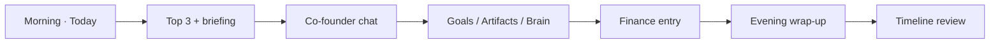

# AIgolet Next

<p align="center">
  <strong>Founder Operating Platform for solo entrepreneurs</strong><br/>
  An AI co-founder with simple flows and deep capability — not a feature dump.
</p>

<p align="center">
  <a href="README.md">English</a> ·
  <a href="README.zh-CN.md">简体中文</a>
</p>

<p align="center">
  
  
  
  
  
</p>

---

## Overview

**AIgolet Next** (brand: **Algolet**) is a local-first desktop platform built for **one-person companies**. It combines an event-sourced orchestrator, SQLite persistence, audit-grade logging, and a polished Electron UI into a single founder cockpit.

The product goal is straightforward:

> Open the app in the morning, know what matters today, work with an AI co-founder that remembers your company, and end the day with a clear record of decisions, outputs, and runway.

This repository is a **self-developed TypeScript monorepo**. It is inspired by ideas from the [OpenClaw](https://github.com/openclaw/openclaw) ecosystem (skills, tool use, founder workflows) but does **not** embed the OpenClaw Gateway. Protocol, persistence, and audit layers are independent. Data lives under `~/.algolet/`; the orchestrator listens on **`:3847`**.

---

## Features

| Module | What it does |
|--------|----------------|
| **Today** | AI-generated Top 3 priorities, risk radar, pending decisions, approval cards |
| **Co-founder** | Conversational AI with automatic Company Brain context injection |
| **Goals** | Quarterly OKRs → weekly plan → daily tasks (with AI breakdown) |
| **Company Brain** | Decisions, customers, principles, retrospectives + semantic search |
| **Artifacts** | Generate pitch outlines, weekly reports, quotes, contract checklists |
| **Finance** | Lightweight income/expense tracking and runway estimation |
| **Secretary** | Private AI staff (time / personal / work); cron lives under time-type secretaries |
| **Timeline** | Unified feed of decisions, artifacts, goals, and transactions |

**Platform capabilities**

- Multi-turn **agent tool loop** (OpenAI-compatible function calling)
- **SSE streaming** chat with reasoning-model support (`reasoning_content`)
- **Skills runtime** (full `SKILL.md` injection + `skill_{slug}` tools)
- **MCP** stdio bridge for external tools
- **WebSocket** global event bus
- **Append-only audit ledger** with hash chain
- **File upload** in chat (PDF, Word, Excel, PPT, …)
- Office tools: `read_pdf`, `read_docx`, `read_xlsx`, `read_pptx`, workspace I/O, memory tools

---

## Design principles

| Principle | Meaning |
|-----------|---------|
| **One cockpit** | Default UX is solo founder; team/org features live under Advanced |
| **Outcomes over infra** | Business results in UI; Run IDs stay in technical views |
| **Proactive > reactive** | Briefings, nudges, confirm-before-execute proposals |
| **Compounding context** | Decisions and customers persist and feed the co-founder |
| **Simple surface, deep engine** | Three-click main flows; power stays in the backend |

---

## A founder's day



1. **Morning** — Open **Today** → refresh plan or generate morning briefing → act on **pending approvals**
2. **Daytime** — Talk to **Co-founder** → tick **Goals** → generate **Artifacts** → log decisions/customers in **Company Brain**
3. **Anytime** — Record transactions; watch runway on the dashboard
4. **Evening** — Evening briefing → review **Timeline**

---

## Quick start

### Prerequisites

- **Node.js** ≥ 20 (22+ recommended for built-in SQLite)
- **pnpm** 10.x

### Install & run

```bash
git clone <repository-url>
cd AIgolet-next
pnpm install
pnpm start
```

`pnpm start` launches the orchestrator (`http://127.0.0.1:3847`) and the Electron desktop app.

### First-time setup

1. Open **Settings** and configure an LLM provider (OpenAI-compatible API or **Stub** for offline testing).
2. Use **Test connection** to verify credentials.
3. Open **Today** and click **Refresh today's plan**.

**Data directory**

| Path | Purpose |
|------|---------|
| `~/.algolet/aigolet.db` | SQLite database |
| `~/.algolet/workspace/` | Files, uploads, generated artifacts |

Override with `AIGOLET_DATA_DIR`.

---

## Navigation

### Primary (sidebar)

| Route | Name | Purpose |
|-------|------|---------|
| `/` | Today | Command center |
| `/chat` | Co-founder | Main AI conversation |
| `/goals` | Goals | OKR pipeline |
| `/brain` | Company Brain | Structured company knowledge |
| `/artifacts` | Artifacts | Document factory |
| `/finance` | Finance | Runway & transactions |
| `/timeline` | Timeline | Unified activity feed |
| `/secretary` | Secretary | Private AI staff + schedules |

### Advanced (collapsed)

| Route | Name |
|-------|------|
| `/agents` | HR / org chart (team mode) |
| `/tasks` | Technical run tracking |
| `/audit` | Audit ledger |
| `/skills` | Skills |
| `/settings` | Settings |

`/memory` redirects to `/brain` (semantic memory is merged into the Brain search tab).

---

## Architecture

```
apps/desktop          Electron + React founder UI
apps/server           Hono orchestrator (:3847, HTTP + SSE + WebSocket)
packages/founder      Runway, briefings, brain services, founder tools
packages/persistence  SQLite SSOT (schema v6+)
packages/agent-runtime Agent loop + brain context + streaming
packages/orchestrator Run / session lifecycle
packages/tools        Workspace, office, memory, founder tools
packages/memory       Episodic / semantic memory + embeddings
packages/audit        Hash-chain audit projector
packages/model-gateway LLM providers (OpenAI-compatible, stub)
packages/mcp          MCP stdio bridge
packages/cli          Projection rebuild CLI
packages/protocol     Shared types & events
```

**Event sourcing:** domain events are the source of truth; audit and memory are projections. Rebuild with:

```bash
pnpm rebuild-projections -- --dry-run   # preview
pnpm rebuild-projections                # rebuild audit + memory projections
```

---

## API reference (founder domain)

| Domain | Endpoints |
|--------|-----------|
| Today | `GET/POST /api/founder/today`, `/refresh`, `/briefing/morning`, `/briefing/evening` |
| Goals | `GET/POST/PATCH/DELETE /api/goals`, `POST /api/goals/breakdown` |
| Brain | `/api/brain/decisions\|customers\|principles\|retrospectives`, `GET /summary`, `POST /quick-capture`, `GET /search` |
| Artifacts | `GET /api/artifacts`, `POST /api/artifacts/generate` |
| Finance | `/api/finance/transactions`, `/runway`, `/settings`, `/reminders` |
| Proposals | `GET /api/proposals`, `POST /api/proposals/:id/approve\|dismiss`, `/scan` |
| Timeline | `GET /api/timeline` |
| Runs / Chat | `POST /api/runs`, `GET /api/runs/:id/stream` (SSE), `GET /api/chat/history` |

Legacy APIs (cron, skills, MCP, audit, org/RBAC) remain available. See [README.zh-CN.md](README.zh-CN.md) for extended examples and curl snippets.

---

## Development

```bash
pnpm dev              # Hot reload (server + desktop + packages)
pnpm build            # Full monorepo build (required before release)
pnpm typecheck        # TypeScript check
pnpm lint             # Lint all packages
pnpm rebuild-projections
```

**Tests**

```bash
pnpm --filter @aigolet-next/founder test
pnpm --filter @aigolet-next/persistence test
pnpm --filter @aigolet-next/model-gateway test
pnpm --filter @aigolet-next/agent-runtime test
```

**Monorepo layout**

```
AIgolet-next/
├── apps/
│   ├── desktop/      # Electron shell
│   └── server/       # Hono API
├── packages/         # Shared libraries
├── scripts/          # Dev helpers (port cleanup, etc.)
├── package.json
├── pnpm-workspace.yaml
└── turbo.json
```

---

## Relationship to Aigolet-app / OpenClaw

| | **AIgolet-next** (this repo) | **Aigolet-app** (sibling) |
|--|------------------------------|---------------------------|
| Runtime | Self-developed orchestrator | Embedded OpenClaw Gateway |
| Port | `:3847` | `:18789` |
| Data | `~/.algolet/` | `~/.openclaw/` |
| Focus | Founder OS, audit, structured brain | Full OpenClaw channel & skill ecosystem |

---

## Known limitations

- Calendar integration in briefings is stubbed (no Google/Outlook yet)
- Proposal approval updates lightweight fields; complex automation needs secretary/cron setup
- Embedding quality depends on provider config (stub embeddings are weak)
- Org chart / RBAC is optional (Advanced), not the default solo path
- Optimized for **Electron desktop**; browser dev mode works but is secondary
- Anthropic native Messages API requires an OpenAI-compatible proxy endpoint for tool calling

---

## Security notes

- API keys stored via Electron `safeStorage` and synced to server config
- File tools scoped to `~/.algolet/workspace/`
- Upload whitelist and 20 MB size limit
- Admin reset endpoints require confirmation (`/api/admin/*`)

---

## License

This project is licensed under the **[GNU Affero General Public License v3.0 or later (AGPL-3.0-or-later)](LICENSE)**.

| Document | Description |
|----------|-------------|
| [`LICENSE`](LICENSE) | Full legal text |
| [`docs/OPEN_SOURCE.md`](docs/OPEN_SOURCE.md) | What AGPL means for users & contributors (English) |
| [`docs/OPEN_SOURCE.zh-CN.md`](docs/OPEN_SOURCE.zh-CN.md) | 许可说明（简体中文） |
| [`CONTRIBUTING.md`](CONTRIBUTING.md) | How to contribute |

**Summary:** You may read, run, and modify the code. If you distribute the software or offer it as a network service, you must provide corresponding source under the same license. **Algolet / AIgolet trademarks** are not covered by this license.

For commercial licensing outside AGPL terms, contact `legal@aigolet.com` *(replace with your official address)*.

---

<p align="center">
  Built for founders who run the whole company — and want an AI that runs with them.
</p>
