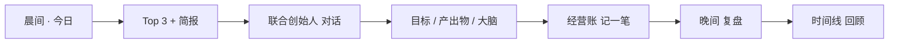

# AIgolet Next

<p align="center">
  <strong>帮你经营一人公司的 AI 联合创始人。</strong><br/>
  在一个本地优先的创始人驾驶舱里，规划、决策、执行并追踪你的事业。
</p>

<p align="center">
  <a href="https://algolet.com"><strong>algolet.com</strong></a>
</p>

<p align="center">
  <a href="README.md">English</a> ·
  <a href="README.zh-CN.md">简体中文</a>
</p>

<p align="center">
  
  
  
  
  
</p>

---

## 概述

**AIgolet Next**（品牌名 **[Algolet](https://algolet.com)**）是面向**独立创始人**的本地优先桌面平台。它将事件溯源编排器、SQLite 持久化、可审计日志与 Electron UI 整合为统一的创始人驾驶舱。

产品目标：

> 早晨打开应用，知道今天最重要的事；与记得公司上下文的 AI 联合创始人协作；结束时留下决策、产出与资金跑道的清晰记录。

本仓库为**自研 TypeScript monorepo**，借鉴 [OpenClaw](https://github.com/openclaw/openclaw) 生态理念（Skills、工具调用、创始人工作流），但**不嵌入** OpenClaw Gateway。协议、持久化与审计层完全独立。数据目录 `~/.algolet/`，编排器端口 **`:3847`**。

---

## 功能模块

| 模块 | 说明 |
|------|------|
| **今日** | AI Top 3、风险雷达、待决策、待确认卡片 |
| **联合创始人** | 对话式 AI，自动注入公司大脑上下文 |
| **目标** | 季度 OKR → 本周计划 → 今日任务（AI 拆解） |
| **公司大脑** | 决策、客户、原则、复盘 + 语义搜索 |
| **产出物** | 生成 BP 大纲、周报、报价单、合同清单 |
| **经营账** | 轻量收支与 runway 估算 |
| **秘书** | 私人 AI 员工（时间/个人/工作）；Cron 在时间类秘书内管理 |
| **时间线** | 决策、产出、目标、财务统一时间轴 |

**平台能力**

- 多轮 **Agent 工具循环**（OpenAI 兼容 function calling）
- **SSE 流式**对话，支持 reasoning 模型 `reasoning_content`
- **Skills 运行时**（完整 `SKILL.md` + `skill_{slug}` 工具）
- **MCP** stdio 桥接
- **WebSocket** 全局事件流
- **审计 hash 链**（append-only）
- 聊天 **文件上传**（PDF、Word、Excel、PPT 等）
- 办公工具：`read_pdf`、`read_docx`、`read_xlsx`、`read_pptx`、工作区读写、记忆工具

---

## 设计原则

| 原则 | 说明 |
|------|------|
| **一人驾驶舱** | 默认 solo founder；团队/组织在「高级」中 |
| **结果优先** | UI 展示业务结果；Run ID 留在技术视图 |
| **主动 > 被动** | 简报、提醒、确认后执行 |
| **公司复利** | 决策与客户档案持久关联 |
| **浅层简单** | 主流程 3 次点击；深度在后端 |

---

## 创始人一日流程



1. **早晨** — **今日** → 刷新计划或生成晨间简报 → 处理待确认
2. **白天** — **联合创始人** → **目标** → **产出物** → **公司大脑** 记录决策/客户
3. **随时** — **经营账** 更新 runway
4. **晚间** — 晚间简报 → **时间线** 回顾

---

## 快速开始

### 环境要求

- **Node.js** ≥ 20（推荐 22+，内置 SQLite）
- **pnpm** 10.x

### 安装与运行

```bash
git clone https://github.com/xavier-chen/AIgolet-next.git
cd AIgolet-next
pnpm install
pnpm start
```

`pnpm start` 同时启动编排器（`http://127.0.0.1:3847`）与 Electron 桌面端。

### 首次配置

1. **设置** → 配置 LLM（OpenAI 兼容 API 或 **Stub** 离线测试）
2. **测试连接** 验证 API
3. **今日** → **刷新今日计划**

**数据目录**

| 路径 | 用途 |
|------|------|
| `~/.algolet/aigolet.db` | SQLite 数据库 |
| `~/.algolet/workspace/` | 文件、上传、产出物 |

可通过 `AIGOLET_DATA_DIR` 覆盖。

---

## 导航

### 主流程

| 路由 | 名称 | 用途 |
|------|------|------|
| `/` | 今日 | 指挥中心 |
| `/chat` | 联合创始人 | 主对话 |
| `/goals` | 目标 | OKR 流水线 |
| `/brain` | 公司大脑 | 结构化公司知识 |
| `/artifacts` | 产出物 | 文档工厂 |
| `/finance` | 经营账 | runway 与收支 |
| `/timeline` | 时间线 | 统一动态 |
| `/secretary` | 秘书 | 私人 AI + 定时日程 |

### 高级（折叠）

| 路由 | 名称 |
|------|------|
| `/agents` | 人力资源 / 组织架构 |
| `/tasks` | 任务（Run 追踪） |
| `/audit` | 审计 |
| `/skills` | 技能 |
| `/settings` | 设置 |

`/memory` 重定向至 `/brain`。

---

## 公司大脑用法

| Tab | 用途 | 快捷方式 |
|-----|------|----------|
| 决策日志 | 背景、选项、选择、复盘日期 | `record_decision` / 快速记录 |
| 客户档案 | pipeline + 7 天未联系高亮 | 「记录跟进」/ `update_customer` |
| 原则库 | 品牌/产品/定价原则 | 注入联合创始人上下文 |
| 复盘 | 事件、教训 | — |
| 语义搜索 | 大脑 + 历程统一搜索 | 无 embedding 时关键词可用 |

**API 示例**

```bash
curl -s http://127.0.0.1:3847/api/brain/summary

curl -s -X POST http://127.0.0.1:3847/api/brain/decisions \
  -H 'Content-Type: application/json' \
  -d '{"title":"是否做年度订阅","context":"现金流 vs 转化","reviewDate":"2026-06-24"}'

curl -s -X POST http://127.0.0.1:3847/api/brain/quick-capture \
  -H 'Content-Type: application/json' \
  -d '{"text":"客户张三想年付八折，我还没答应","locale":"zh"}'

curl -s 'http://127.0.0.1:3847/api/brain/search?q=张三'
```

---

## 架构

```
apps/desktop          Electron + React
apps/server           Hono 编排器 (:3847)
packages/founder      简报、runway、大脑服务
packages/persistence  SQLite SSOT
packages/agent-runtime Agent 循环 + 流式
packages/orchestrator Run / Session
packages/tools        工具注册
packages/memory       记忆与 embedding
packages/audit        审计投影
packages/model-gateway LLM 网关
packages/mcp          MCP 桥接
packages/cli          投影重建
packages/protocol     共享类型
```

**投影重建**

```bash
pnpm rebuild-projections -- --dry-run
pnpm rebuild-projections
```

---

## API 摘要

| 域 | 端点 |
|----|------|
| 今日 | `/api/founder/today`, `/refresh`, `/briefing/morning`, `/briefing/evening` |
| 目标 | `/api/goals`, `/api/goals/breakdown` |
| 大脑 | `/api/brain/*`, `/quick-capture`, `/search` |
| 产出物 | `/api/artifacts`, `/generate` |
| 财务 | `/api/finance/*` |
| 提案 | `/api/proposals/*` |
| 时间线 | `/api/timeline` |
| 对话 | `POST /api/runs`, `GET /api/runs/:id/stream` (SSE) |

---

## 开发

```bash
pnpm dev
pnpm build
pnpm typecheck
pnpm lint
```

```bash
pnpm --filter @aigolet-next/founder test
pnpm --filter @aigolet-next/persistence test
```

---

## 与 Aigolet-app / OpenClaw

| | **AIgolet-next** | **Aigolet-app** |
|--|------------------|-----------------|
| 运行时 | 自研编排器 | 嵌入 OpenClaw |
| 端口 | `:3847` | `:18789` |
| 数据 | `~/.algolet/` | `~/.openclaw/` |

---

## 已知限制

- 简报中日历为 stub，未接 Google/Outlook
- Embedding 质量取决于配置（stub 语义较弱）
- 组织架构/RBAC 在高级区，非默认 solo 路径
- 主要为 Electron 桌面优化
- Anthropic 原生 API 需 OpenAI 兼容端点以支持 tool calling

---

## 许可证

本项目采用 **[GNU Affero General Public License v3.0 或更高版本（AGPL-3.0-or-later）](LICENSE)** 授权。

| 文档 | 说明 |
|------|------|
| [`LICENSE`](LICENSE) | 完整法律文本 |
| [`docs/OPEN_SOURCE.zh-CN.md`](docs/OPEN_SOURCE.zh-CN.md) | 许可说明（简体中文） |
| [`docs/OPEN_SOURCE.md`](docs/OPEN_SOURCE.md) | License guide (English) |
| [`CONTRIBUTING.zh-CN.md`](CONTRIBUTING.zh-CN.md) | 贡献指南 |

**摘要：** 可阅读、运行、修改代码；若**分发**或**对外提供网络服务**，须在同一许可下提供相应源代码。**Algolet / AIgolet 商标**不在本许可范围内。

如需在 AGPL 义务之外的商业授权，请联系 `legal@aigolet.com`（请替换为正式邮箱）。
